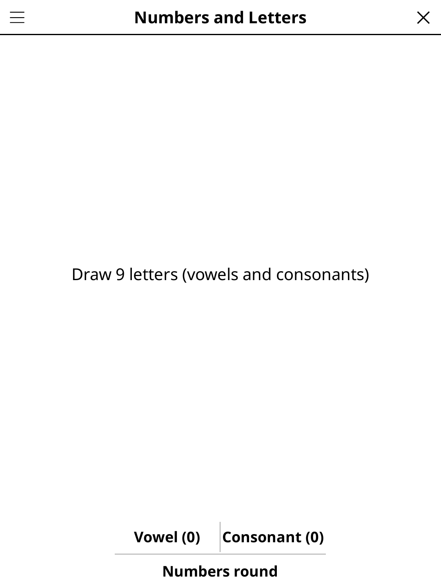

# numletters.koplugin

A **Chiffres et Lettres** display plugin for [KOReader](https://github.com/koreader/koreader) — the classic French TV word-and-numbers game for table play.

## Screenshot



## Concept

Two round types alternate around the table:

**Letters round** — Draw 9 letters one by one (Vowel or Consonant). When all 9 are drawn the countdown starts. Every player finds the longest word they can make using each drawn letter at most once. Tap *Solutions* to reveal all valid words, grouped by length.

**Numbers round** — 6 random numbers (1–100) are drawn and a 3-digit target is shown. Players use +, −, ×, ÷ to combine the numbers and reach (or get closest to) the target. Everyone writes their calculation on paper and compares.

No typing during play — pen and paper only.

## Rules

**Letters round:** Draw 9 letters (Vowel / Consonant). Find the longest word using each letter at most once. Longest word wins; tap **Solutions** to reveal all valid words.

**Numbers round:** 6 numbers drawn (1–100) + a 3-digit target. Combine them with +, −, ×, ÷ to reach (or get closest to) the target. Exact match scores 10 pts; within 1–5 scores 7; within 6–10 scores 3.

## Features

- **Letters mode** — 9-letter draw with Vowel / Consonant buttons, 45-second countdown
- **Numbers mode** — 6 numbers + 3-digit target, 45-second countdown
- **Solutions reveal** — all valid dictionary words grouped and sorted by length (letters mode)
- **Two dictionaries** — FR (47,435 words, 3-7 letters) and EN (105,145 words, 3-9 letters, from the Public-Domain [ENABLE](https://github.com/dolph/dictionary) list); shared with `boggle.koplugin`. Only the English list covers the full 9-tile draw, so 8- and 9-letter solutions show up in EN rounds only.
- **E-ink friendly** — tile display is static during play; only the timer digit refreshes in fast/A2 mode

## Controls

### Letters round

| Button | Action |
|--------|--------|
| **Voyelle / Vowel** | Draw a vowel tile |
| **Consonne / Consonant** | Draw a consonant tile |
| **Solutions** | Stop timer and reveal all valid words |
| **Nouvelle partie / New** | Clear the board and start over |

### Numbers round

| Button | Action |
|--------|--------|
| **Nouveaux chiffres / New numbers** | Draw 6 numbers + new target |
| **Solutions** | Stop timer (no solver — compare on paper) |

### Common

| Button | Action |
|--------|--------|
| **Lettres / Chiffres** | Switch between Letters and Numbers mode |
| **Options** | Language |
| **Rules** | Show rules reminder |
| **Close** | Exit |

## Scoring (standard Chiffres et Lettres)

**Letters:** longest valid word wins. Equal length = tie.

**Numbers:** exact target = 10 pts; within 5 = 7 pts; within 10 = 5 pts; furthest away = 0.

Adjust scoring to your house rules — the plugin tracks no scores; players use paper.

## Installation

### Via KOReader Plugin Manager

```
numletters.koplugin/ → KOReader plugins/ folder
game-common/          → alongside plugins/ (shared library)
```

> **Note:** the zip already bundles `board.lua`, `words_en.lua` and `words_fr.lua`
> from `boggle.koplugin`, so you do **not** need to install Boggle separately.

### Manual

1. Download `numletters.zip` from [Releases](../../releases).
2. Extract to your KOReader `plugins/` directory.
3. Restart KOReader — **Chiffres et Lettres** appears in the Tools menu.

## Development

`numletters.koplugin/` lives inside the
[koreader-plugins](https://github.com/t2ym5u/koreader-plugins) monorepo.
`board.lua`, `words_en.lua` and `words_fr.lua` are symlinks to `boggle.koplugin/`
in the dev tree; they are copied as real files into the distribution zip.

## License

GPL-3.0
